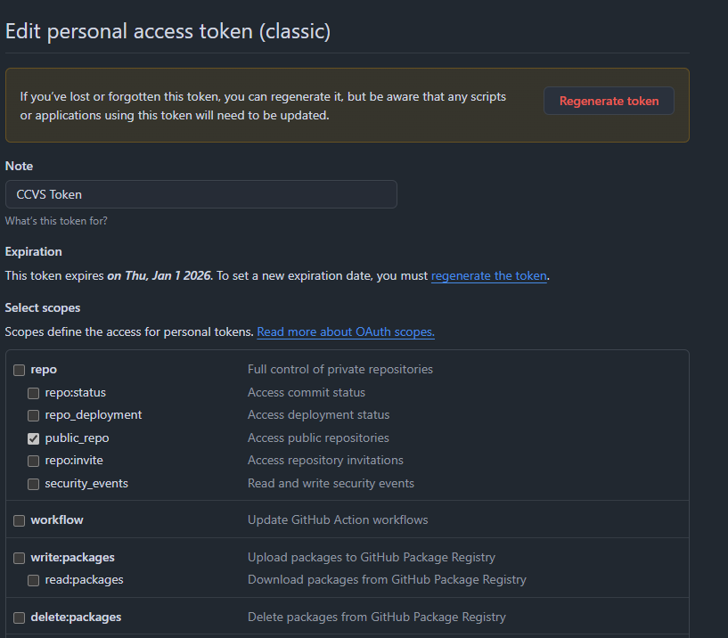

# Prerequisites

- Python: Duh!
- Git: Ensure you have Git installed and configured.

# Setup Instructions

1. ## Clone the Repository

```
git clone https://github.com/laween-alsulaivany/CCVS.git
cd CCVS
```

2. ## Create a Virtual Environment

```
python -m venv venv
venv\Scripts\activate  # For Windows
```

3. ## Install Dependencies

```
pip install -r requirements.txt
```

4. ## Install the Package in Editable Mode

```
pip install -e .
```

5. ## Configure GitHub Integration

- Create a .env file in src and add the following:

```
GITHUB_TOKEN=your_github_token
```

to make generate your GitHub Personal Access Token. You can generate one by logging into GitHub, navigating to Settings > Developer settings > Personal access tokens > Tokens (classic),
Enable public_repo and create the token. copy and paste that into your .env file. DO NOT DIRECTLY COPY IT TO YOUR CONFIG.PY.



# Project Structure

- src/: Contains the main source code for the project.
  - main.py: Entry point for the application.
  - config.py: Configuration file for GitHub integration.
  - data_persistence.py: Module for saving and loading game state.
  - github_integration.py: Module for committing game state to GitHub.
  - scheduler.py: Module for scheduling automated commits.
  - chess.py: Placeholder for the chess board rendering function.
- tests/: Contains unit tests for the project.
  - conftest.py: Configuration for pytest.
  - test_commit.py: Test for committing game state to GitHub.
  - test_save_state.py: Test for saving game state to a local file.
  - test_scheduler.py: Test for the schedul

# Add Your Code

- Add your new modules or update existing ones in the src directory.
- Write unit tests for your code and place them in the tests directory.
- Run Tests

```
pytest
pytest tests/test_commit.py # Example usage (make sure you are in the project root directory)
```
